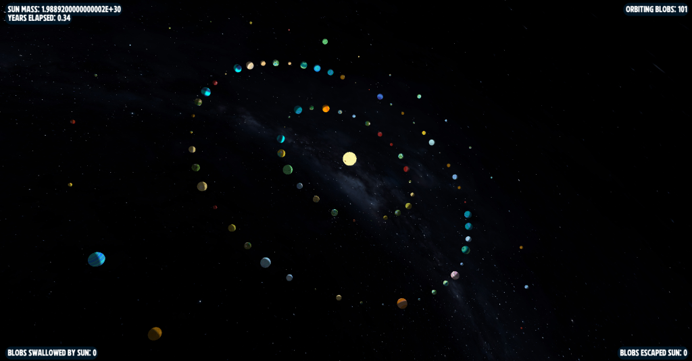
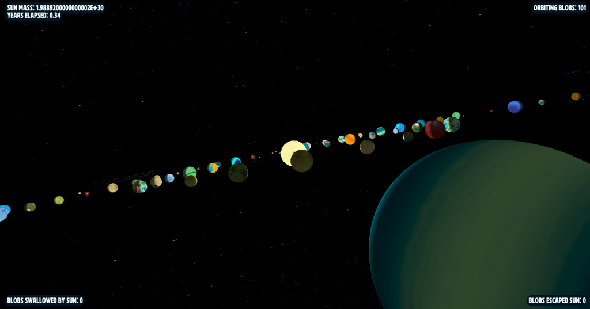
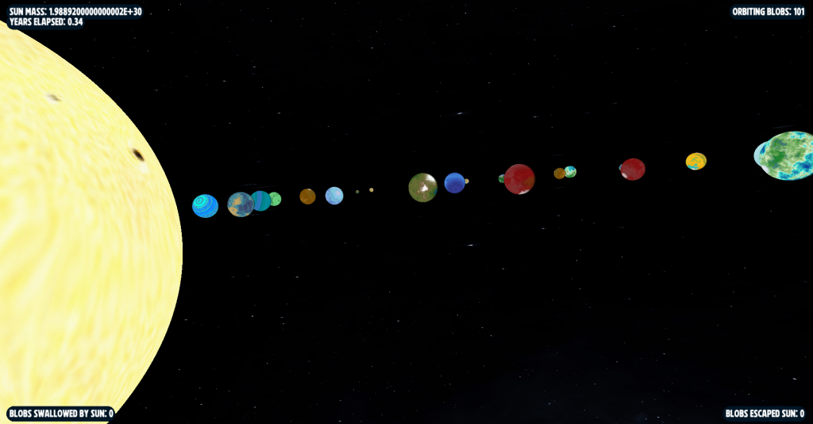
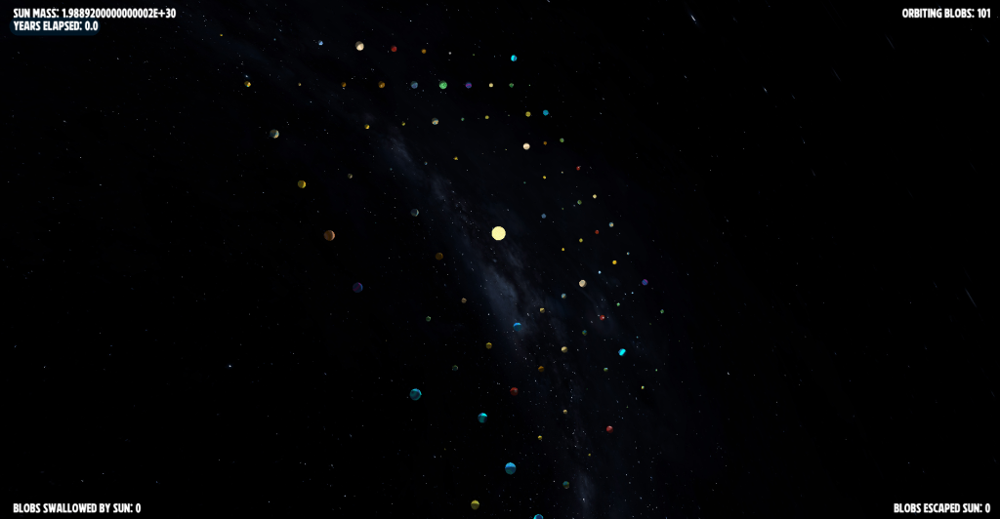
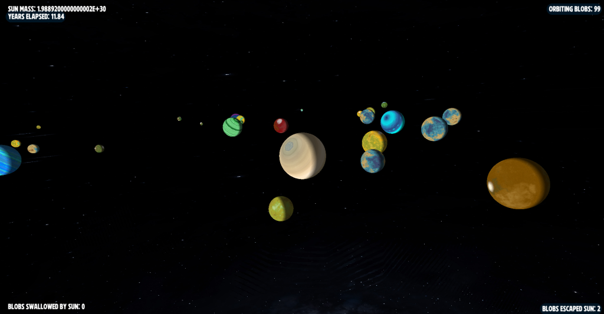

# Newton's Blobs

### Version 0.0.5 Alpha Prototype 3D

*A simulator of Newton's laws of physics, using space scale objects*

This is a small project just for me to learn and experiment. In spite of a life long interest in physics, I've never brought it to my programming skills. This is my playground for doing so. I am not a physicist though, so don't hold this to that standard! Feedback and/or help building this out is always welcome.

Alpha release 0.0.5! This is the full 3D version. And now there is full movement control -- you have forward, backward, up, down, right, left, as well as full 360 rotation with pitch, yaw, and roll! As blobs orbit, go anywhere you want to view them from any angle. Pause and click on a blob to get its name, size, and position. Much more to come in the future!

To toggle auto save and load, just press the 3 key. To pause, press the spacebar. Full instructions below.

#### Installation

Two ways, the easy way (Windows only) and the nerdy way . . .

###### The easy way (Windows only)

1. Download Windows executable here:
   1. [Release 0.0.6](https://github.com/jmottster/newton/releases/download/Release%2Fv0.0.6/newton3D.exe)
2. Save where you want to store it
3. Double click and enjoy (runs as is, no system installation)

###### The nerdy way

1. **Requirements:**
   1. git and github account
   2. python 3.11 or newer
      1. Ursina 6.1.2
      2. Numpy 1.26.3
      3. Pygame-CE 2.4.0 (only to run fake 3D version)
2. **In terminal:**
   1. **cd** to desired working dir
   2. **git clone https://github.com/jmottster/newton.git**
      1. ^ or whatever method you use to pull a repository from github
   3. run **python main.py**
   4. for fake 3D version: run **python main_pyg.py** (no movement controls)

#### Instructions

This is a space-level gravity and collision simulator. At the center is a sun mass blob, and orbiting it are randomly created Earth to Jupiter mass blobs. This simulation uses real space level values for distance, mass, velocity, and acceleration. The size of the blobs are exaggerated, of course, but the orbiting blob sizes are properly proportional to each other from Jupiter sized to Earth sized (however,, the center blob is smaller in proportion than the sun would be to them). Time is sped up to about 600 hours per second for the fake 3D version, and 900 hours per second for the 3D version.

This is a prototype, a proof of concept. Thus, it's not very interactive yet, it's just showing what it can simulate. However, there are movement controls here while you watch it go.

* Movement controls:
  * W - Move forward
  * S - Move backward
  * A - Move left
  * D - Move right
  * E - Move up
  * X - Move down
  * MOUSE WHEEL SCROLL UP - increase speed
  * MOUSE WHEEL SCROLL DOWN - decrease speed
  * R - Return to default speed
* Rotation controls:
  * Z - Roll left
  * C - Roll right
  * MOUSE MOVE LEFT - Yaw left
  * MOUSE MOVE RIGHT - Yaw right
  * MOUSE MOVE FORWARD - Pitch up
  * MOUSE MOVE BACKWARD - Pitch down
* Miscellaneous Controls:
  * SPACEBAR - Pause/Unpause
    * Only when paused . . .
    * MOUSE LEFT CLICK on Blob - Toggle info sign above the blob (name, mass, radius, position)
    * MOUSE RIGHT CLICK on Blob - Follow this blob (blob becomes you reference frame, you move with it, but can still also move freely)
  * ESC - Quit
  * Q - Disengage/reengage mouse
  * F - Toggle fullscreen/windowed mode
  * V - Toggle ambient light (helps to see dark side of blobs)
  * B - Toggle show name of blobs above blobs (for all blobs, this will impact performance)
  * UP ARROW - Increase timescale (make time go faster)
  * DOWN ARROW - Decrease timescale (make time go slower)
  * 1 - Start over based on options selected with keys 1 and 2
  * 2 - Toggle stat displays
  * 3 - Toggle auto save/load feature (if on, will save app state upon exit and reload it on next startup)
  * 4 - Toggle Start pattern between square and circular (see below)
  * 5 - Toggle start velocities between perfect orbit and random (it'll be within a range that works)
  * 6 - Toggle start orbit with angular chaos

Some screen shots:

