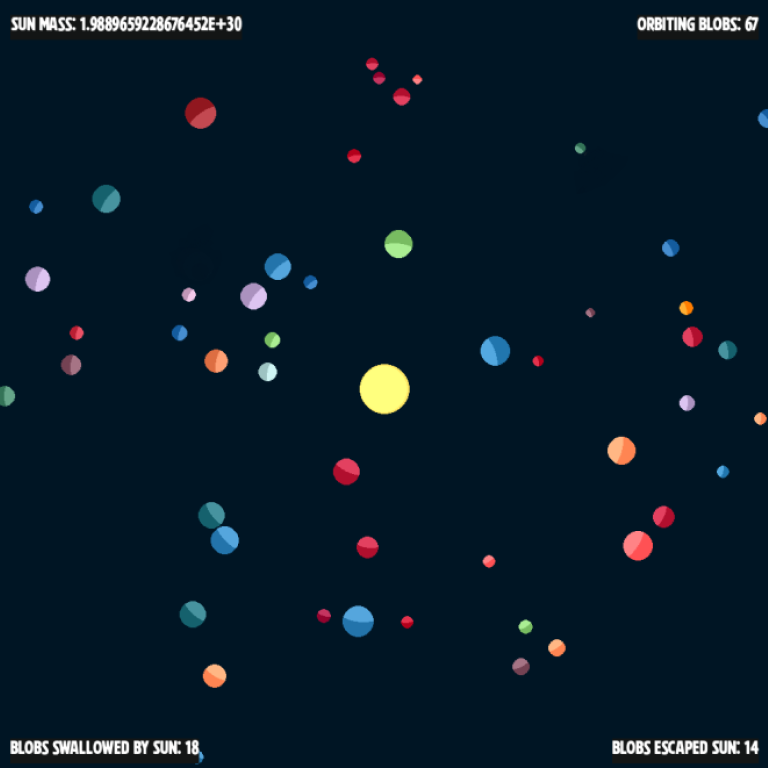
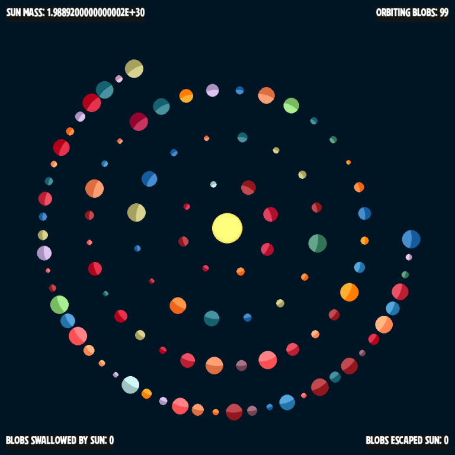
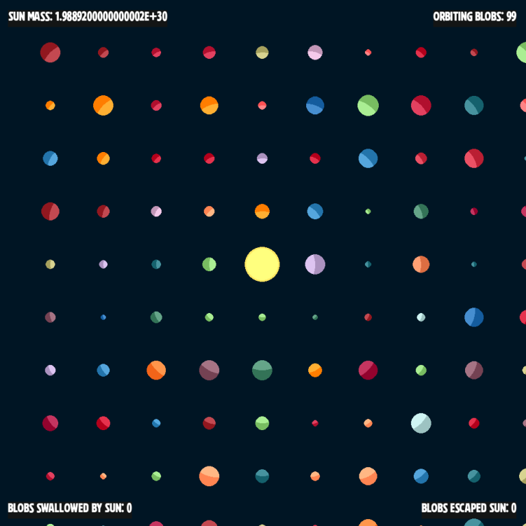

# Newton's Blobs

*A simulator of Newton's laws of physiscs, using space scale objects*

This is a small project just for me to learn and experiment. In spite of a life long interest in physics, I've never brought it to my programming skills. This is my playground for doing so. I am not a physicist though, so don't hold this to that standard! Feedback and/or help building this out is always welcome.

Alpha release 0.0.1! This is the prototype 2d version. It'll probably be the only 2d version, as the 3d version is well under way.

There isn't much to it, but it can be fun to just watch the blobs go . . .

## Instructions

This is a gravity and collision simulator. At the center is a sun sized blob, and orbiting it are randomly created Earth to Mercury sized blobs. This simulation uses real space level values for distance, mass, velocity, and acceleration. The size of the blobs are exaggerated, of course, and distance is scaled when rendered on the screen. :D Time is sped up to about 360 days per second.

There are a few controls here while you watch it go.

* SPACEBAR - Puase/Unpause
* D - Toggle stat displays
* A - Toggle Start pattern between square and circular (see below)
* W - Toggle start velocities between perfect orbit and random (it'll be within a range that works)
* S - Start over based on above options!

Here are Windows executable downloads if you're not inclined to fiddle around with Python code. The window is not resizable, so there is a 1000x1000 and a 768x768 version.

[Release 0.0.1 downloads](https://github.com/jmottster/newton/releases/tag/release%2F0.0.1)

Here are screen shots of the two optional starting patterns . . .

