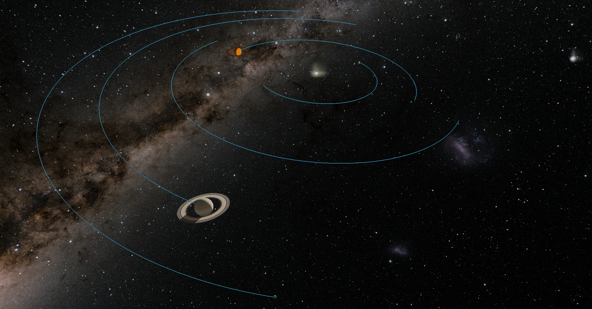
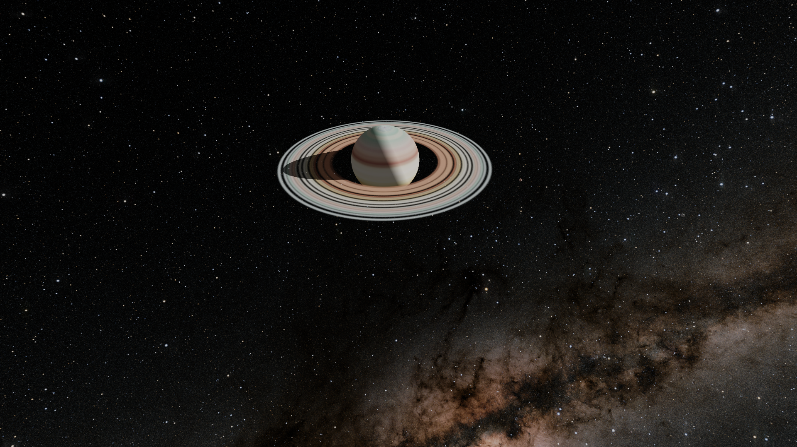

# Newton's Blobs

### Version 0.0.6 Alpha Prototype 3D

*A simulator of Newton's laws of physics, using space scale objects*

This is a small project just for me to learn and experiment. In spite of a life long interest in physics, I've never brought it to my programming skills. This is my playground for doing so. I am not a physicist though, so don't hold this to that standard! Feedback and/or help building this out is always welcome.

Alpha release 0.0.6! It has full movement control -- you have forward, backward, up, down, right, left, as well as full 360 rotation with pitch, yaw, and roll! As blobs orbit, go anywhere you want to view them from any angle. Turn on orbit trails to better track blobs, enlage blobs to a scaled up size to better find/track them. Pause and click on a blob to get its name, size, and position. Pause and click on a blob to change your inertial frame of referece to it when you unpause! Much more to come in the future!

To toggle auto save and load, just press the 3 key. To pause, press the spacebar. **Full instructions below.**

#### Installation

Two ways, the easy way (Windows only) and the nerdy way . . .

###### The easy way (Windows only)

1. Download Windows executable here:
   1. [Release 0.0.6](https://github.com/jmottster/newton/releases/download/Release%2Fv0.0.6/newton3D.exe)
2. Save where you want to store it
3. Double click and enjoy (runs as is, no system installation)

###### The nerdy way

1. **Requirements:**
   1. git and github account
   2. python 3.11 or newer
      1. Ursina 6.1.2
      2. Numpy 1.26.3
      3. Pygame-CE 2.4.0 (only to run fake 3D version)
2. **In terminal:**
   1. **cd** to desired working dir
   2. **git clone https://github.com/jmottster/newton.git**
      1. ^ or whatever method you use to pull a repository from github
   3. run **python main.py**
   4. for fake 3D version: run **python main_pyg.py** (no movement controls)

#### Instructions

This is a space-level gravity and collision simulator. Movement is controled with keyboard and mouse just like a first person shooter game. At the center is a sun mass blob, and orbiting it are randomly created Earth to Jupiter mass blobs, and they have moon sized (Mimas to Ganymede mass) blobs orbiting them. This simulation uses real space level values for distance, mass, velocity, and acceleration. The size of the blobs are exaggerated, of course, but the orbiting blob sizes and masses are properly proportional to each other from Sun sized to Earth sized to Mimas sized. Time is sped up to about 48 hours per second, and is adjustable via arrow keys.

This is a prototype, a proof of concept. It's mostly showing what it can simulate. However, there are movement and exploration controls here while you watch it go.

* Movement controls:
  * W - Move forward
  * S - Move backward
  * A - Move left
  * D - Move right
  * E - Move up
  * X - Move down
  * MOUSE WHEEL SCROLL UP - increase speed
  * MOUSE WHEEL SCROLL DOWN - decrease speed
  * R - Return to default speed
* Rotation controls:
  * Z - Roll left
  * C - Roll right
  * MOUSE MOVE LEFT - Yaw left
  * MOUSE MOVE RIGHT - Yaw right
  * MOUSE MOVE FORWARD - Pitch up
  * MOUSE MOVE BACKWARD - Pitch down
* Miscellaneous Controls:
  * 1 - Start over based on options selected with keys 4, 5, and 6
  * 2 - Toggle stat displays
  * 3 - Toggle auto save/load feature (if on, will save app state upon exit and reload it on next startup)
  * 4 - Toggle Start pattern between square and circular (see below)
  * 5 - Toggle start velocities between perfect orbit and random (it'll be within a range that works)
  * 6 - Toggle start orbit with angular chaos
  * SPACEBAR - Pause/Unpause
    * Only when paused . . .
    * MOUSE LEFT CLICK on Blob - Toggle info flag above the blob (name, mass, radius, position, or just name; see H key)
    * MOUSE RIGHT CLICK on Blob - Follow this blob (blob becomes you reference frame, you move with it, but can still also move freely)
  * ESC - Quit
  * Q - Disengage/reengage mouse
  * R - Return to default speed
  * F - Toggle fullscreen/windowed mode
  * V - Toggle ambient light (helps to see dark side of blobs)
  * T - Toggle blob trails to show orbit path (doesn't apply to moons)
  * G - Toggle cursor and gimbal on/off
  * B - Toggle show info flag (name of blob above blob) on all blobs, this will impact performance
  * Y - Toggle exaggerate planet sizes
  * H - Toggle show full details (when info flag is on) or just name (see MOUSE LEFT CLICK)
  * N - Toggle show info flag for planets only (ONLY when B is activated, doesn't include flagS turned on with MOUSE LEFT CLICK)
  * U - Toggle exaggerate moon sizes
  * UP ARROW - Increase timescale (make time go faster)
  * DOWN ARROW - Decrease timescale (make time go slower)

Some screen shots:

---

Here's the splash screen as it's starting up . . .

---

Below is what you first see. It's the center blob orbited by barely seeable blobs (the sun and planets). Given the attempt to keep sizes realistic, planets are much smaller than the sun. While the sun to planets sizes are to scale, the spaces between them are smaller to make blobs easier to find and navigating between them bearable.

---

Below is the same scene as above, but with the "exaggerate planet sizes" feature toggled on (by pressing "Y"). This makes it easier to find them and see where the are in relation to each other. There simulated size is still the smaller one, so if they get close in this state, they may overlap each other (i.e., collisions would still happen at the smaller scale).

---

Below is

---

Below is

---

Below is

---

Below is

---

Below is

---

Below is

