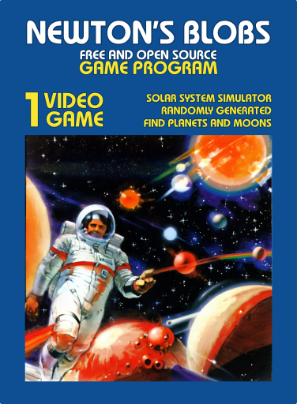
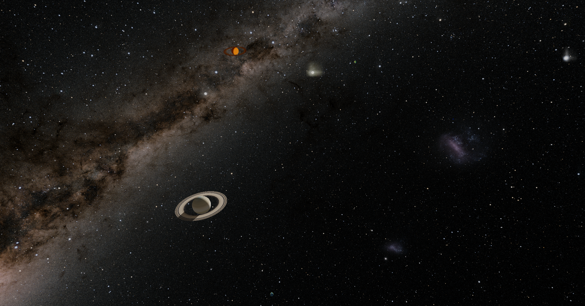
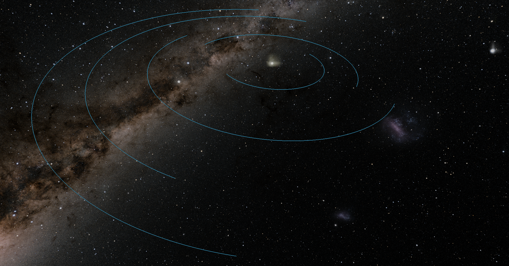
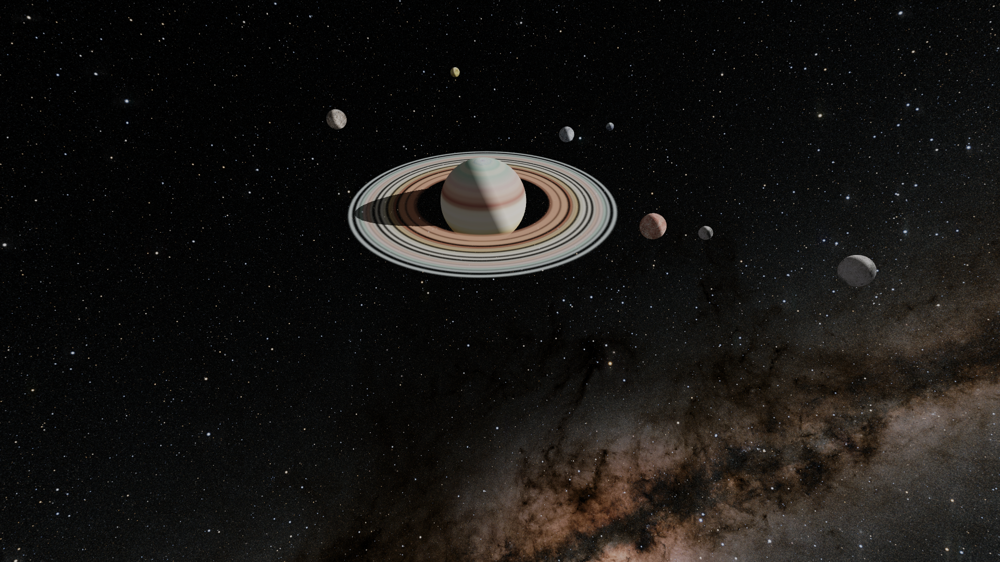
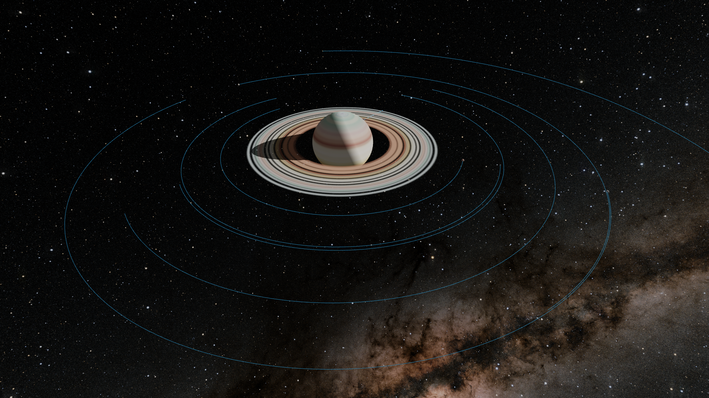

# Newton's Blobs

### Version 0.2.2 Alpha Prototype 3D

**_Explore randomly generated solar systems with planets and moons!_**

 
This is a small project just for me to learn and experiment. In spite of a life long interest in physics, I've never brought it to my programming skills. This is my playground for doing so. I am not a physicist though, so don't hold this to that standard! Feedback and/or help building this out is always welcome. 
 
Featuring time rewind. Reverse time in 90 day increments all the way to the beginning of the simulation session. Use the left and right arrow keys to select how far back to go, then press the "M" key to make it so! 
 
This simulation has full 3D first person movement control -- you have forward, backward, up, down, right, left, as well as full 360 rotation with pitch, yaw, and roll! As blobs orbit, go anywhere you want to view them from any angle. Turn on orbit trails to better track blobs, enlarge blobs to a scaled up size to better find/track them. Pause and click on a blob to get its name, size, and position. Pause and click on a blob to change your inertial frame of reference to it when you unpause! Much more to come in the future! 
 

To toggle auto save and load, just press the 3 key. To pause, press the spacebar. **See below for full explanation and instructions.**

#### Installation

Two ways, the easy way and the nerdy way . . .

###### The easy way (Windows 10 and Ubuntu 24.04 only)

1. Download Ubuntu 24.04 executable here:
   1. [Ubuntu Release 0.2.2](https://github.com/jmottster/newton/releases/download/Release%2Fv0.2.2/newton3D.bin)
2. Download Windows 10 executable here:
   1. [Windows Release 0.2.2](https://github.com/jmottster/newton/releases/download/Release%2Fv0.2.2/newton3D.exe)
3. Save where you want to store it
4. You may need to whitelist the executable with your malware protection software
5. These may work on other versions of Windows and Ubuntu, but haven't been tested for it
6. Double click and enjoy (runs as is, no system installation)

###### The nerdy way

1. **Requirements:**
   1. git and github account
   2. python 3.12 or newer
      1. Ursina 7.0.0
      2. Numpy 1.26.3 or newer
2. **In terminal:**
   1. **cd** to desired working dir
   2. **git clone https://github.com/jmottster/newton.git**
      1. ^ or whatever method you use to pull a repository from github
   3. run **python main.py**

#### Instructions

This is a space-level gravity and collision simulator that randomly generates solar systems with 5 planets and 35 moons randomly distributed among them. Each iteration is unique, no two generated solar systems are ever the same. You can explore and navigate through space from a first person perspective, controlled with keyboard and mouse just like a first person shooter game. At the center is a sun size/mass blob, and orbiting it are randomly created Earth to Jupiter size/mass blobs, and they have moon (Enceladus to Ganymede size/mass) blobs orbiting them. This simulation uses real space level values for distance, mass, velocity, and acceleration. The size of the blobs are exaggerated (otherwise the space between them would be unbearably huge) but the orbiting blob sizes and masses are properly proportional to each other from Sun sized to Earth sized to Enceladus sized. Time is sped up to about 12 hours per second, and is adjustable via up and down arrow keys.

A PDF version of the following quick reference for controls can be downloaded [here](https://github.com/jmottster/newton/releases/download/Release%2Fv0.2.2/controls_quick_reference.pdf).

- Movement controls:
  - W - Move forward
  - S - Move backward
  - A - Move left
  - D - Move right
  - E - Move up
  - X - Move down
  - MOUSE WHEEL SCROLL UP - increase speed
  - MOUSE WHEEL SCROLL DOWN - decrease speed
  - R - Return to default speed
- Rotation controls:
  - Z - Roll left
  - C - Roll right
  - MOUSE MOVE LEFT - Yaw left
  - MOUSE MOVE RIGHT - Yaw right
  - MOUSE MOVE FORWARD - Pitch up
  - MOUSE MOVE BACKWARD - Pitch down
- Miscellaneous Controls:
  - 1 - Start over based on options selected with keys 4, 5, and 6
  - 2 - Toggle stat displays
  - 3 - Toggle auto save/load feature (if on, will save app state upon exit and reload it on next startup)
  - 4 - Toggle Start pattern between square and circular (see below)
  - 5 - Toggle start velocities between perfect orbit and random (it'll be within a range that works)
  - 6 - Toggle start orbit with angular chaos
  - SPACEBAR - Pause/Unpause
    - Only when paused . . .
    - MOUSE LEFT CLICK on Blob - Toggle info flag above the blob (name, mass, radius, position, or just name; see H key)
    - MOUSE RIGHT CLICK on Blob - Follow this blob (blob becomes you reference frame, you move with it, but can still also move freely)
  - ESC - Quit
  - Q - Disengage/reengage mouse
  - R - Return to default speed
  - F - Toggle fullscreen/windowed mode
  - V - Toggle ambient light (helps to see dark side of blobs)
  - T - Toggle blob trails to show orbit path (doesn't apply to moons)
  - G - Toggle cursor and gimbal on/off
  - B - Toggle show info flag (name of blob above blob) on all blobs, this will impact performance
  - Y - Toggle exaggerate planet sizes
  - H - Toggle show full details (when info flag is on) or just name (see MOUSE LEFT CLICK)
  - N - Toggle show info flag for planets only (ONLY when B is activated, doesn't include flagS turned on with MOUSE LEFT CLICK)
  - U - Toggle exaggerate moon sizes
  - M - Activate time rewind
  - UP ARROW - Increase timescale (make time go faster)
  - DOWN ARROW - Decrease timescale (make time go slower)
  - LEFT ARROW - Adjust time rewind
  - RIGHT ARROW - Adjust time rewind

Some screen shots:

---

Here's the splash screen as it's starting up . . .

---

Below is what you first see. It's the center blob orbited by barely seeable blobs (the sun and planets). Given the attempt to keep sizes realistic, planets are much smaller than the sun. While the sun to planets sizes are to scale, the spaces between them are smaller to make blobs easier to find and navigating between them bearable.

---

Below is the same scene as above, but with the "exaggerate planet sizes" feature toggled on (by pressing "Y"). This makes it easier to find them and see where the are in relation to each other. Their simulated sizes are still the smaller ones, so if they get close in this state, they may overlap each other (i.e., collisions would still happen at the smaller scale). While its easier to see them as you move toward them, you will not see their moons until you return them to their normal sizes (by pressing "Y"). Of course, as you get closer, you won't need their size to be exaggerated.

---

Below is the scene with blobs all regular size and orbit trails toggled on (by pressing "T"). This makes it easier to see where the planet blobs are while maintaining the properly scaled sizes. As you move closer to a blob it will be more visible and eventually you can get close enough to see their moons as well.

---

Below is the same scene as above, but with the "exaggerate planet sizes" feature toggled on (by pressing "Y") as well as orbit trails toggled on (by pressing "T"). This makes it easier to find them and see where the are in relation to each other and their respective orbits. Their simulated sizes are still the smaller ones, so if they get close in this state, they may overlap each other (i.e., collisions would still happen at the smaller scale).

---

Below is a close up scene of a planet blob (normal size) and its orbiting moon blobs (normal size). This is typical of what you'd see as you move closer to a blob at normal size.

---

Below is the same scene as above, but with the "exaggerate moon sizes" feature toggled on (by pressing "U"). This won't always be necessary, depending on the size of the planet blob. Larger gas giant sized blobs will require it more, as moon blobs are quite small by comparison.

---

Below is a close up scene of a planet blob (normal size) and its orbiting moon blobs (normal size) with orbit trails toggled on (by pressing "T").

---

Below is the same as above with the "exaggerate moon sizes" feature toggled on (by pressing "U") and with orbit trails toggled on (by pressing "T").

